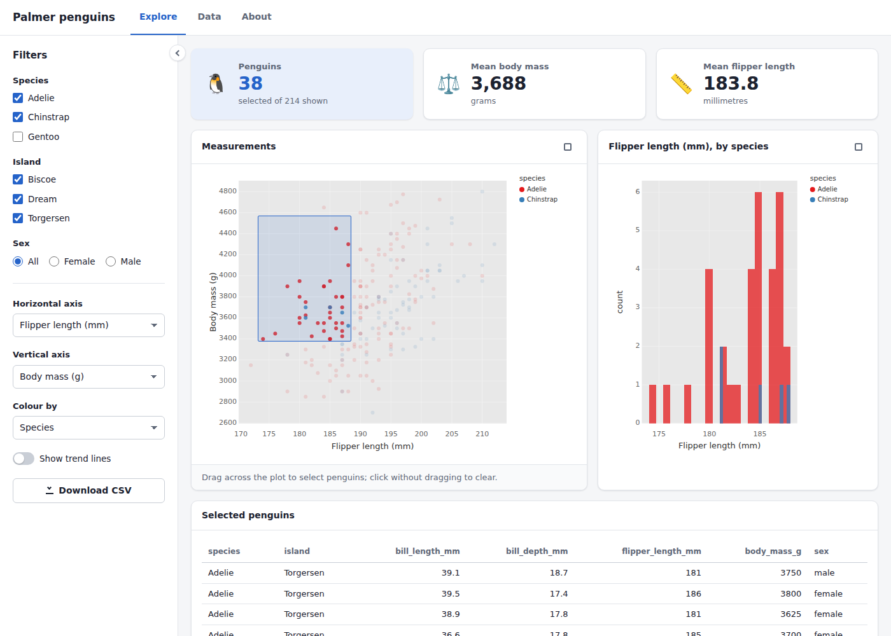

# clj-dashboards

Interactive, reactive web dashboards in Clojure, in the spirit of
[Shiny](https://shiny.posit.co/). You describe a page of inputs and
outputs, write a server function that computes the outputs from the
inputs, and the framework keeps the browser in sync. The UI is hiccup,
the browser side is [Datastar](https://data-star.dev) over server-sent
events, and there's no JavaScript to write and no front-end build.

It's built on the [scicloj](https://scicloj.github.io/) stack:
[tablecloth](https://github.com/scicloj/tablecloth) datasets,
[plotje](https://github.com/scicloj/plotje) plots,
[fastmath](https://github.com/generateme/fastmath) statistics, and
[Kindly](https://github.com/scicloj/kindly)-annotated values.

```clojure
(ns hello.app
  (:require [dashboards.app :as app]
            [dashboards.reactive :as r]
            [dashboards.render :as render]
            [dashboards.ui :as ui]
            [fastmath.random :as random]
            [scicloj.plotje.api :as pj]
            [tablecloth.api :as tc]))

(def ui
  (ui/page-sidebar {:title "Hello"}
    (ui/sidebar
      (ui/slider-input :n "Sample size" {:min 10 :max 1000 :value 200})
      (ui/slider-input :bins "Bins" {:min 5 :max 50 :value 20}))
    (ui/card {:title "Histogram"} (ui/plot-output :hist))))

(defn server [{:keys [input]}]
  (let [sample (r/reactive (random/->seq (random/distribution :normal) (input :n)))]
    {:hist (render/plot (-> (tc/dataset {:x @sample})
                            (pj/lay-histogram :x {:bins (input :bins)})))}))

(app/app {:title "Hello" :ui ui :server server})
```

Moving the *Bins* slider redraws only the plot. Moving *Sample size*
draws a new sample first, because `sample` depends on `:n`.



## Layout: building is separate from hosting

Like Shiny, the library you write apps with is separate from the
infrastructure that serves them.

| Directory | What it is | Shiny equivalent |
|---|---|---|
| [`core/`](core) | **Writing apps.** UI components, the reactive engine, renderers, the session protocol and the browser client (Datastar plus a small companion script). It knows nothing about HTTP servers. | the `shiny` package |
| [`server/`](server) | **Hosting apps.** An http-kit server that runs each browser tab's session over a server-sent event stream, plus downloads and static files. It serves one app, a list of apps, or a directory of app folders, and reloads them when they change. | Shiny Server |
| [`deploy/`](deploy) | A container image of the server, with a compose file, an HTTPS proxy and an nginx example. | `rocker/shiny` |
| [`template/`](template) | A starter project for your own dashboard: REPL setup, uberjar build and Dockerfile. | |
| [`examples/apps/`](examples/apps) | Example apps, each a folder with an `app.clj`. | `shiny::runExample()` |

An app is just a value, `(app/app {:ui … :server …})`. How it gets served
is decided separately.

## Running the examples

You need Java 21+, the [Clojure CLI](https://clojure.org/guides/install_clojure)
and [Babashka](https://babashka.org). Every script is a bb task;
`bb tasks` lists them.

```sh
bb examples                    # all examples at http://localhost:8080/
bb serve --app examples/apps/penguins --port 3000
```

- **hello**: Shiny's classic first app. A random sample and its
  histogram, with the whole UI written as data and a colour picker in
  plain hiccup.
- **penguins**: filters, linked brushing (drag over the scatter plot to
  filter the table and histogram), validation messages, a CSV download,
  and a multi-page navbar.
- **live**: a background thread feeds a value that every session shares,
  so all open windows update together while each keeps its own controls.

## Writing an app

### UI

A UI is hiccup. Write it whichever of three ways suits, and mix them
freely:

```clojure
;; 1. Functions from dashboards.ui
(ui/card {:title "Histogram"}
  (ui/slider-input :bins "Bins" {:min 5 :max 50 :value 20})
  (ui/plot-output :hist))

;; 2. The same components as data: tags expand to exactly the above
[:ui/card {:title "Histogram"}
 [:ui/slider-input {:id :bins :label "Bins" :min 5 :max 50 :value 20}]
 [:ui/plot-output {:id :hist}]]

;; 3. Plain hiccup with Datastar attributes
[:div {:data-signals:bins "20"}
 [:label "Bins " [:span {:data-text "$bins"}]]
 [:input {:type "range" :min 5 :max 50 :data-bind "bins"}]
 [:div#hist.dsh-output-plot {:style "height:400px"}]]
```

In all three, the server reads `(input :bins)` and fills the element
with id `hist`. Any element can be an input: an input is a
[Datastar signal](https://data-star.dev/guide/reactive_signals), and
`(input :bar-color)` reads the signal `barColor` (Datastar camel-cases
names). Anything else Datastar does, such as `data-show`, `data-class`
and `data-text`, runs in the browser with no round trip.

A UI made only of tags is a plain value you can store, generate or
send. Add your own tags with `defcomponent`:

```clojure
(ui/defcomponent :my/kpi [{:keys [id label]} _children]
  (ui/value-box {:title label :value (ui/text-output id)}))

[:my/kpi {:id :revenue :label "Revenue"}]
```

The components:

- **Pages:** `page`, `page-sidebar`, `page-navbar` (with `nav-panel`s)
- **Layout:** `layout-sidebar`/`sidebar`, `layout-columns`, `card`,
  `value-box`, `navset-tabs`
- **Inputs:** `text-input`, `textarea-input`, `numeric-input`,
  `slider-input`, `select-input` (single or `:multiple?`),
  `checkbox-input`, `switch-input`, `checkbox-group-input`,
  `radio-buttons`, `date-input`, `action-button`
- **Outputs:** `plot-output`, `table-output`, `text-output`,
  `verbatim-output`, `ui-output`, `download-button`

Choices keep their Clojure values. With `(ui/select-input :x "X" [:bill_length_mm :body_mass_g])`,
`(input :x)` gives back the keyword `:bill_length_mm`, not a string.
A choice list can also be a map from value to label.

### Server

The server function runs once per browser session. It gets the inputs and
returns a map from output id to *render spec*:

```clojure
(defn server [{:keys [input session]}]
  {:plot  (render/plot  …a plotje pose…)        ; sized to its element
   :table (render/table …a dataset or seq of maps…)
   :count (render/text  …)
   :info  (render/print …)                      ; pretty-printed / captured stdout
   :extra (render/ui    …hiccup, may contain more inputs and outputs…)
   :any   (render/auto  …picks by type, Kindly-aware…)
   :csv   (render/download {:filename "data.csv"} …dataset, string or bytes…)})
```

Read inputs with `(input :id)` or `(input :id default)`. Whatever a render
body reads becomes a dependency, and the output re-renders when it changes.

### Reactivity (`dashboards.reactive`)

| | |
|---|---|
| `(r/reactive …)` | cached computation, recomputed when its dependencies change; read with `@` |
| `(r/value init)` | reactive state that works like an atom: `@`, `reset!`, `swap!` |
| `(r/observe …)` | side effect that re-runs on change |
| `(r/observe-event (input :save) …)` | run when an event fires, without tracking the body |
| `(r/event-reactive (input :go) …)` | a reactive that only updates on an event |
| `(r/isolate …)` | read without depending |
| `(r/req x …)` | stop quietly until values are present |
| `(r/validate test "message" …)` | show a friendly message instead of the output |
| `(r/invalidate-later ms)` | re-run after a delay, for clocks and polling |
| `(r/reactive-poll ms check read)` | re-read a source when a cheap check changes |
| `(r/debounce f ms)` | follow a fast-changing value once it settles |

A `value` or `reactive` defined at the top level of a namespace is shared
by every session. Writing to it from any thread updates every open
browser. Each session's code runs on its own serial executor, so a session
never races with itself.

Session helpers live in `dashboards.session`: `notify!`,
`update-input!` (change choices or values from the server), `on-ended`,
and `request`, which gives you the Ring request so you can read headers
like a user name from an authenticating proxy.

### Plot interaction

`(ui/plot-output :scatter {:brush :selection})` lets users drag a
rectangle over the points. `(input :selection)` then holds the selected
points' row indices into the plotted dataset, so
`(tc/select-rows data (input :selection))` gives the selected rows. A
click without dragging clears it to an empty vector.
`:click` reports a single clicked point the same way. plotje tooltips
(the `:tooltip` layer option) work too.

## How it talks to the browser

Datastar does the browser's side, and everything travels over plain
HTTP, with no websockets.

- **Server to browser:** each tab opens one long-lived
  [server-sent event](https://html.spec.whatwg.org/multipage/server-sent-events.html)
  stream. Rendered outputs arrive as Datastar's `datastar-patch-elements`
  events and are morphed into place. Values the server sets arrive as
  `datastar-patch-signals`. Busy states, notifications and new choices
  for an input arrive as a small `datastar-dashboards` event.
- **Browser to server:** whenever a signal changes, Datastar POSTs a
  snapshot of all of them. The server diffs it against the session's
  inputs, so only the outputs that depend on what changed re-render.
- **Reconnecting:** the session id is a signal, so a browser whose
  stream drops simply reopens it and carries on in the same session.
  Because the inputs live in the browser, a page outlives even a server
  restart: it reconnects to a fresh session that starts from the inputs
  the page already has. A drop that is back within about 1.5 seconds
  goes unnoticed; a longer one shows *Reconnecting…* until the stream
  returns.
- **Session lifetime:** a session lives as long as its page sends a
  heartbeat (every 20s). It ends after `:session-timeout-ms` of silence,
  or straight away when the page closes and sends its goodbye beacon.

The events are written with the official
[Datastar Clojure SDK](https://github.com/starfederation/datastar-clojure)
(`dashboards.datastar`), and the server streams them through the SDK's
http-kit adapter. `dashboards.session` defines what a session sends
and receives, so the server module is just one transport: any server
the SDK has an adapter for can carry a session.

## Developing at the REPL

```clojure
(require '[dashboards.server :as server])
(server/run-app! #'my.dashboard/app)   ; http://localhost:8080/
```

Because you pass the var, re-evaluating `app`, `ui` or `server` takes
effect the next time you reload the page.

## Deploying your own

There are three ways, depending on how much you want to own.

### 1. Container with a folder of apps (like Shiny Server)

Put each app in a folder with an `app.clj` whose last form is the app
(see [`examples/apps`](examples/apps)). Read data that ships alongside it
with `(app/local-file "data.csv")`. Put static files in a `www/`
subfolder. Then:

```sh
bb docker:build                 # docker build -f deploy/Dockerfile -t clj-dashboards .
docker run -p 8080:8080 -v "$PWD/my-apps:/srv/dashboards" clj-dashboards
```

Each folder is served at `/<folder>/`, with an index of all apps at `/`.
New or changed apps are picked up without a restart. If an app needs
libraries beyond the bundled scicloj stack, list them as `:deps` in a
`deps.edn` next to its `app.clj`.
[`deploy/docker-compose.yml`](deploy/docker-compose.yml) adds Caddy for
automatic HTTPS and HTTP/2, and [`deploy/server.edn`](deploy/server.edn)
documents the settings.

### 2. Your own project and uberjar

Copy [`template/`](template) (its `deps.edn` pins a clj-dashboards
commit) and write your app in `src/`. Then:

```sh
bb serve                        # serve it locally
bb uber                         # target/my-dashboard.jar
java -jar target/my-dashboard.jar --app my-dashboard.app/app
bb docker                       # or a small JRE image
bb upgrade                      # move to the latest clj-dashboards
```

The jar runs anywhere Java 21 does: a VM, Fly.io, Render, Kubernetes or
systemd. Point health checks at `/_health`, and see
[Running it in production](#running-it-in-production).

### 3. Embedded in your own service

```clojure
(dashboards.server/start! {:port 8080
                           :apps [{:path "/sales" :app #'sales/app}
                                  {:path "/ops"   :app 'ops.dashboard/app}]})
```

Or skip `dashboards.server` entirely. `dashboards.session` is
transport-agnostic: open an SSE response with any Datastar SDK adapter,
give `session/start!` a `send!` of `#(dashboards.datastar/send! sse-gen %)`,
and feed it the browser's signals, read with `dashboards.datastar/read-signals`,
through `receive!`.

### Server options

`bb serve --help` lists them. The options are
`--app [PATH=]APP` (repeatable), `--apps-dir`, `--config FILE`, `--port`,
`--host`, `--base-path`, `--title`, `--no-reload`, `--sanitize-errors`
and `--max-sessions`. A config file can also set `:session-timeout-ms`,
`:keep-alive-ms` and `:shutdown-delay-ms`. The environment variables
`PORT`, `HOST`, `DASHBOARDS_CONFIG`, `DASHBOARDS_APPS_DIR` and
`DASHBOARDS_BASE_PATH` also work.

### Running it in production

Everything is ordinary HTTP, and every URL an app uses is relative, so
it works behind any proxy and under any path prefix. Two things are
unusual: each open tab holds one long-lived response (its event stream,
`_dashboards/stream`), and each tab's session lives in the memory of one
server process. Most of what follows comes from those two facts.

**Serve HTTP/2 to browsers.** The server speaks HTTP/1.1, and over
HTTP/1.1 a browser opens at most six connections to a host, shared by
all its tabs. Every open dashboard tab keeps one of them busy with its
stream, so someone with a handful of tabs open runs out: new tabs hang,
and inputs stop responding because their POSTs can't get a connection.
Over HTTP/2 all the tabs share one connection, with room for many
streams (the browser and proxy negotiate the limit; 100 is typical). So
put a proxy that speaks HTTP/2 in front. Caddy does by default, as in
[`deploy/docker-compose.yml`](deploy/docker-compose.yml), and
[`deploy/nginx.conf`](deploy/nginx.conf) turns it on for nginx. The hop
from the proxy to the server can stay HTTP/1.1.

**Don't buffer the stream.** A proxy that buffers responses holds the
stream's events back, so the page loads but its outputs never arrive.
The server sends `X-Accel-Buffering: no`, which nginx honours, and Caddy
flushes event streams as they come. For anything else, turn response
buffering off for `_dashboards/stream`. If the stream opens but the
server's first event hasn't arrived within 5 seconds, the page shows a
notice that something between the browser and the server (a proxy, VPN,
antivirus or corporate firewall) may be buffering it. If only some
users see it, the culprit is probably on their side; if everyone does,
look at your own proxy.

**Idle timeouts.** Proxies and load balancers close connections that
stay silent too long. The server sends a no-op event on every stream
every 20 seconds (`:keep-alive-ms`), comfortably inside common limits
such as the AWS Application Load Balancer's 60 second idle timeout,
Heroku's 55 second rolling window and Cloudflare's 125 second proxy
read timeout. If something in your path is stricter, lower
`:keep-alive-ms`. A proxy that caps how long a response may last only
causes a reconnect: the browser reopens the stream and carries on in
the same session.

**Deploys and shutdown.** When the server is stopped (SIGTERM, or
`server/stop!`), it:

1. answers 503 on `/_health` and to new streams, so load balancers stop
   sending it new tabs;
2. waits `:shutdown-delay-ms` (default 0) for them to notice;
3. closes every open stream, so each browser reconnects straight away,
   to another instance or to this one once it's back;
4. ends the sessions and exits.

A tab that reconnects to a different or restarted server gets a fresh
session that starts from the inputs the page already has, so users keep
their selections. Per-session state that lives only on the server, such
as an `r/value` created inside a server function, does not survive and
starts again from its initial value. Top-level shared state belongs to
one process, so it doesn't outlive a restart either, and each replica
has its own. Keep anything that must outlast a deploy in a database.

Point readiness checks at `/_health`. Behind a load balancer, set
`:shutdown-delay-ms` long enough for it to see the 503 (a couple of
health-check intervals) and shorter than the time the platform allows
between SIGTERM and killing the process: 10 seconds for `docker stop`
and Cloud Run, 30 seconds by default on Kubernetes
(`terminationGracePeriodSeconds`). 5000 suits most container setups.
With a single instance and nothing to drain to, leave it at 0.

**More than one replica.** A tab's stream and its POSTs must reach the
same instance, or its input changes go to a server that doesn't have
its session. So, as with Shiny Server, use sticky sessions, preferably
by cookie:

- **Caddy:** `lb_policy cookie`, with `health_uri /_health` so a
  draining instance stops getting new tabs (example in
  [`deploy/Caddyfile`](deploy/Caddyfile)):

  ```caddy
  reverse_proxy dashboards-1:8080 dashboards-2:8080 {
  	lb_policy cookie
  	health_uri /_health
  	health_interval 5s
  }
  ```

- **nginx:** `sticky cookie`, which is in open-source nginx from 1.29.6
  (before that, only nginx Plus). On older versions use
  `hash $remote_addr consistent;`, which keys on the client's IP
  address: everyone behind one NAT or corporate proxy lands on the same
  instance, and a phone that changes networks moves to another (where
  it starts a fresh session from its inputs). `consistent` keeps most
  clients in place when you add or remove an instance. Adding
  `proxy_next_upstream error timeout http_503;` to the location lets a
  reconnecting stream that reaches a draining instance try another.

  ```nginx
  upstream dashboards {
      server 10.0.0.1:8080;
      server 10.0.0.2:8080;
      sticky cookie dsh_server path=/ httponly secure;
  }
  ```

- **Kubernetes:** a readiness probe on `/_health`, and cookie affinity
  on the ingress. With ingress-nginx (retired in March 2026, but still
  common; other controllers have equivalents):

  ```yaml
  metadata:
    annotations:
      nginx.ingress.kubernetes.io/affinity: "cookie"
      nginx.ingress.kubernetes.io/affinity-mode: "persistent"
      nginx.ingress.kubernetes.io/session-cookie-name: "dsh-server"
  ```

  `persistent` stops ingress-nginx moving existing sessions to new pods
  when the deployment scales up.

- **AWS Application Load Balancer:** turn on target group stickiness
  with a load-balancer cookie, and use `/_health` as the target group's
  health check:

  ```sh
  aws elbv2 modify-target-group-attributes --target-group-arn <arn> \
    --attributes Key=stickiness.enabled,Value=true Key=stickiness.type,Value=lb_cookie
  ```

**Where it runs.** It needs a long-running process that can hold many
open responses at once.

- Fine: a VM, any container host, Fly.io, Render and Kubernetes. On
  Fly.io and Render, run one instance per app unless you set up
  affinity yourself (on Fly.io, with `fly-replay`).
- Fine: Google Cloud Run, with session affinity, at least one instance
  kept running so pages don't wait for a JVM to start, and the request
  timeout raised from its 5 minute default to the 60 minute maximum so
  streams aren't cut needlessly:
  `gcloud run services update SERVICE --session-affinity --min-instances 1 --timeout 3600`.
  Cloud Run's affinity is best effort, so expect the occasional fresh
  session.
- Not a fit: AWS Lambda and other serverless functions. Invocations
  are short-lived (15 minutes at most on Lambda) and spread across
  instances, so a tab's POSTs don't reach the process holding its
  session.
- Not a fit: Amazon API Gateway REST APIs in front of the server. By
  default they buffer the whole response and give up after 29 seconds;
  their streaming mode still ends a response after 15 minutes. Put an
  Application Load Balancer in front instead.

## Development

```sh
bb test                  # core + server tests (bb test:core, bb test:server)
bb examples              # try the examples
bb template:uber         # build the starter template against this checkout
bb datastar:update 1.0.5 # vendor another Datastar release
```

Datastar is vendored in `core/resources/dashboards/assets` (MIT; see
`DATASTAR-LICENSE.md` there), so deployments need no CDN.

## License

MIT; see [LICENSE](LICENSE). Datastar, vendored in
`core/resources/dashboards/assets`, is also MIT (see
`DATASTAR-LICENSE.md` there). The penguins example data is from the
palmerpenguins package (CC0).
